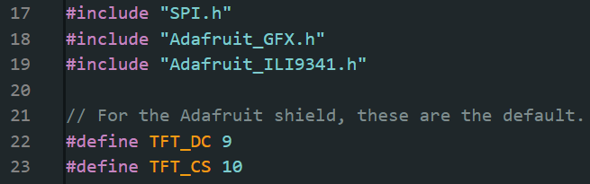
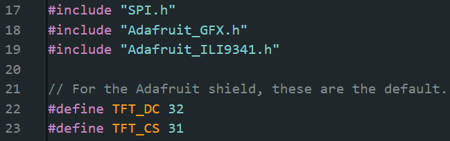
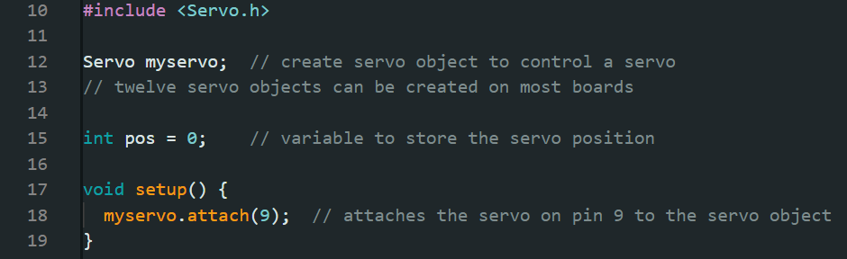

# Adafruit Capacative Touchscreen Guide

This guide will supplement the official guide for using the <a href="https://learn.adafruit.com/adafruit-2-8-and-3-2-color-tft-touchscreen-breakout-v2" target="_blank">Adafruit 2.8" and 3.2" Color TFT Touchscreen Breakout v2</a> with your NM180100 Evaluation Board.

## Requirements

### Hardware
* NM180100EVB
* A USB to micro-USB cable to connect the board
* A Linux or Windows machine
* Hardware to connect the touchscreen to your EVB 

### Software
* Arduino IDE with NM180100EVB Arduino Core set up. <a href="./doc/NM180100EVB_User_Guide.md" target="_blank">Setup Instructions</a>

For this tutorial, wire the display up in SPI mode.

## SPI Wiring

|Touchscreen pin|EVB pin    |
|---------------|-----------|
|3-5V Vin       |5V         |
|GND            |GND (any)  |
|CLK            |5          |
|MISO           |6          |
|MOSI           |7          |
|CS             |31         |
|D/C            |32         |

#### The code will need to be adjusted for CD and D/C

Find the section that has 
```
#define TFT_CS 9
#define TFT_DC 10
```


Change the code to:
```
#define TFT_CS 31
#define TFT_DC 32
```


<b>Note that in some cases these entries may be swapped, so be careful when changing the values, or just copy the snippet above if in doubt.</b>

## Capacative Touchscreen I2C Wiring

|Touchscreen pin|EVB pin|
|---------------|-------|
|SCL            |8      |
|SDA            |9      |


</br>
</br>
</br>
</br>


# Adafruit Motor Shield V2 Guide

This guide will supplement the official guide for using the <a href="https://learn.adafruit.com/adafruit-motor-shield-v2-for-arduino/overview" target="_blank">Adafruit Motor Shield V2</a> with your NM180100 Evaluation Board.

## Requirements

### Hardware
* NM180100EVB
* A USB to micro-USB cable to connect the board
* A Linux or Windows machine
* Some motors to drive!

### Software
* Arduino IDE with NM180100EVB Arduino Core set up. <a href="./doc/NM180100EVB_User_Guide.md" target="_blank">Setup Instructions</a>

## DC Motors and Stepper Motors
Since the NM180100EVB does not have a barrel jack, in order to power DC and stepper motors there are two options:

1. For smaller applications, you can get 5V power to the motor ports by flywiring the 5V pin to the Vin pin on the motor shield and inserting the VIN Jumper. This solution is limited to motors with a draw of 5V and 200mA of current or less.

2. For larger applications, power the shield using an external power source, and remove the VIN Jumper as directed.

## Servo Motors
The servo ports on the shield are not controlled by an onboard PWM driver, but rather are wired through directly to pins 9 and 10 on the motor shield. These correspond to pins 4 and 20 on the NM180100EVB, respectively. Out of these two pins, only pin 4 supports PWM, so only servo port 2 can be used to drive a servo. 

It follows that since pin 4 is the one connected to servo port 2, if you want to run a servo on port 2, you will need to use 

```
myservo.attach(4);
```
to connect the servo to pin 4. By default in the examples, the code uses pin 9. 




</br>
</br>
</br>
</br>

# Adafruit AMG8833 Thermal Camera Sensor

This guide will supplement the official guide for using the <a href="https://learn.adafruit.com/adafruit-motor-shield-v2-for-arduino/overview" target="_blank">Adafruit Motor Shield V2</a> with your NM180100 Evaluation Board.

No changes, just follow the tutorial.