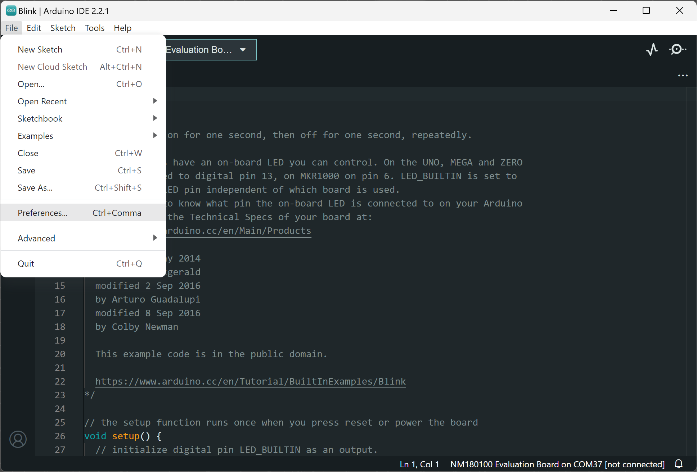
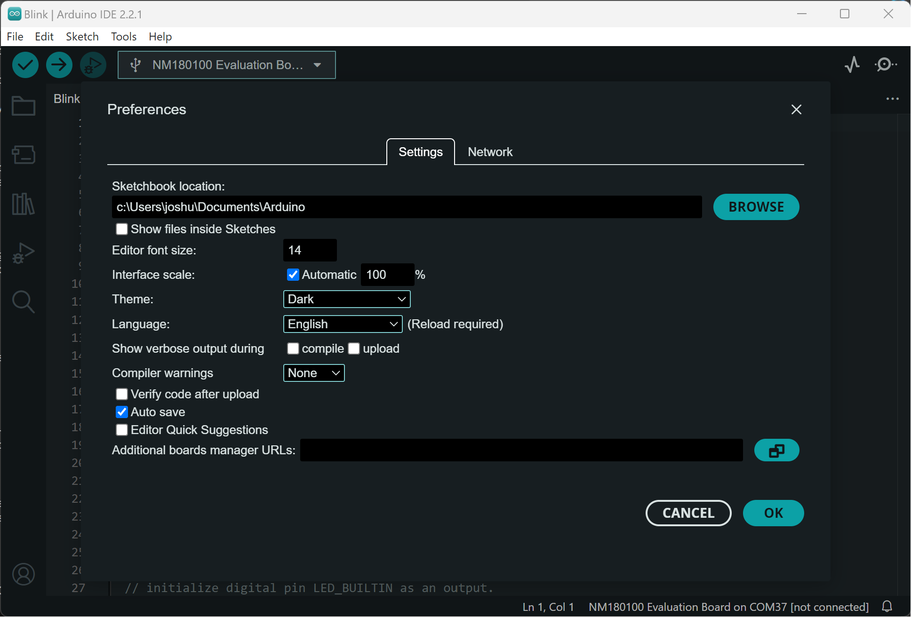
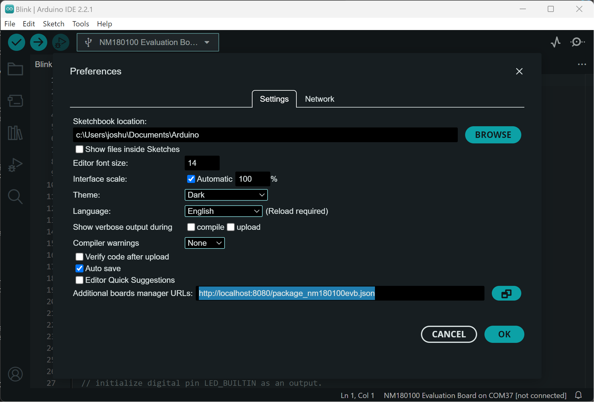
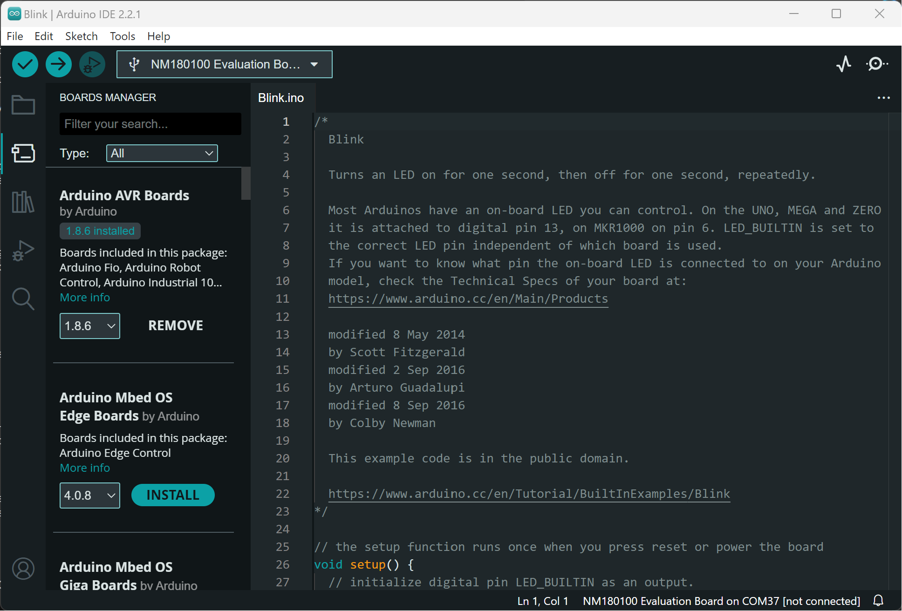
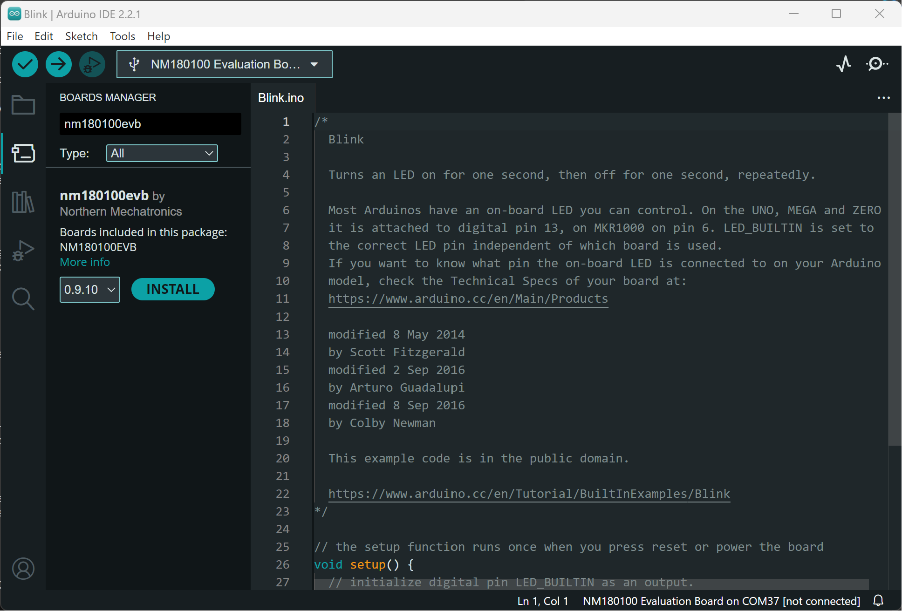

# Arduino Core NM180100

ArduinoCore NM180100 is an open source package for developing and debugging the NM180100 BLE/LoRaWAN wireless module with the Arduino IDE.

## Requirements
* Python 3.7.0 or later
* Linux, Windows
* Supported debug probe
    * CMSIS-DAP
    * Segger J-Link

## Developer's Quick Start Guide
### Setup
* Install python version 3.7.0 or above and add to PATH.
* Install ARM GNU compiler for Cortex-M
* Install git
* Install Segger J-Link
* tar

### Steps
#### Step 1 Get Sources
Clone the source to your local machine

#### Step 2 Develop
Please create a branch from master for your own work.
```
git checkout -b your_development_branch
```

#### Step 3 Test
##### Without Arduino IDE
A test harness is provided under the test directory called test_sketch.cpp.  You can build the code using the cmake extension in VSCode to configure and build the binary for the target board without running the Arduino IDE.

##### With Arduino IDE
There are three main steps to test with the Arduino IDE:
1. Package the Arduino Core
2. Host the package
3. Download the updated package

###### Package Generation
To package the Arduino Core, use the following command at the project root directory:
```
extras\release_package.bat <board_variant> <version> <hosting URL>
```

For example, to generate the package for the EVB with version 0.9.10 and hosting it locally use
```
extras\release_package.bat nm180100evb 0.9.10 http://localhost:8080
```
This will create a staging directory containing a json file and an archive containing the Arduino Core package. 

###### Package Hosting
Once the package is generated, you can host it with the following python commands:
```
cd staging
python -m http.server 8080
```

###### Download the Package
1. Open the Arduino IDE.  Click on File and then Preferences


2. The preferences dialog window will pop up


3. Enter the following in the Additional boards manager URLs field:
```
http://localhost:8080/package_nm180100evb.json
```


4. Back in the Arduino IDE.  Click on the board icon


The BOARDS MANAGER panel opens up.

5. Type the board variant in the search box for the board of interest.  For example,
```
nm180100evb
```


6. Click INSTALL and you are good to go.