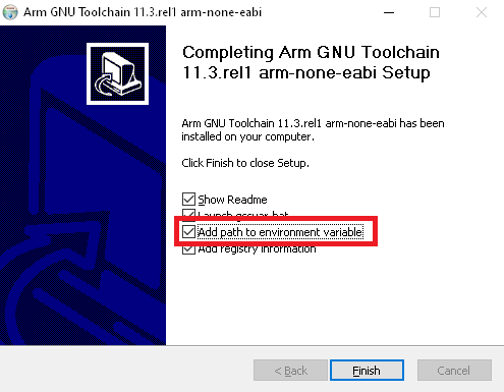
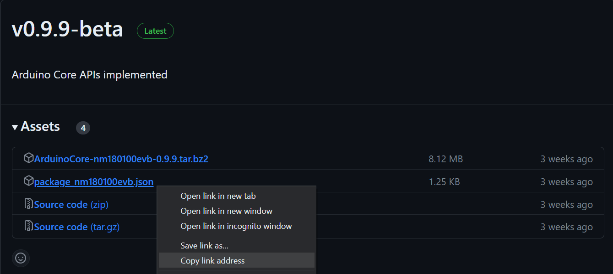
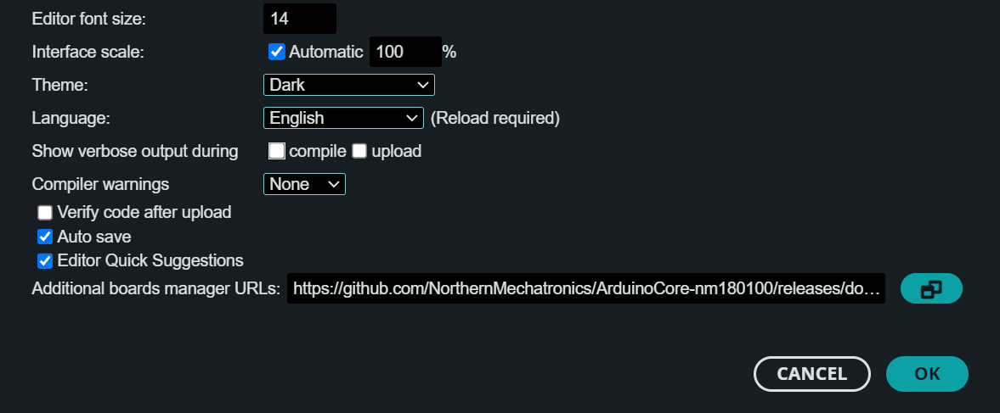
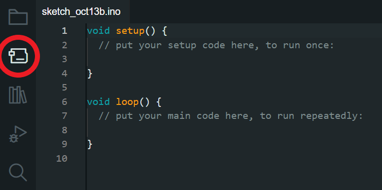
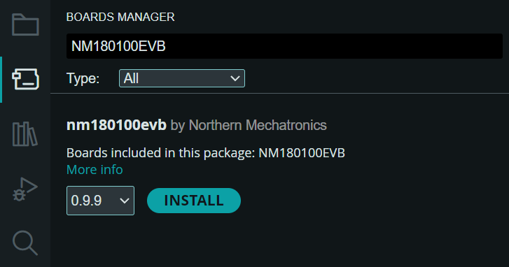
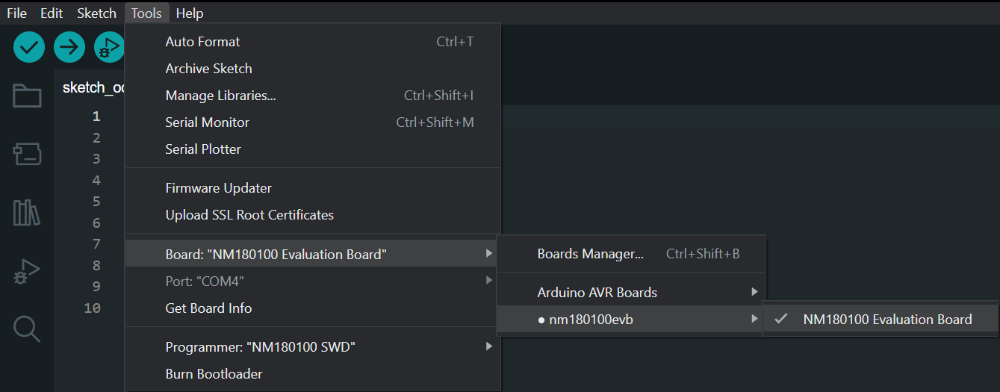
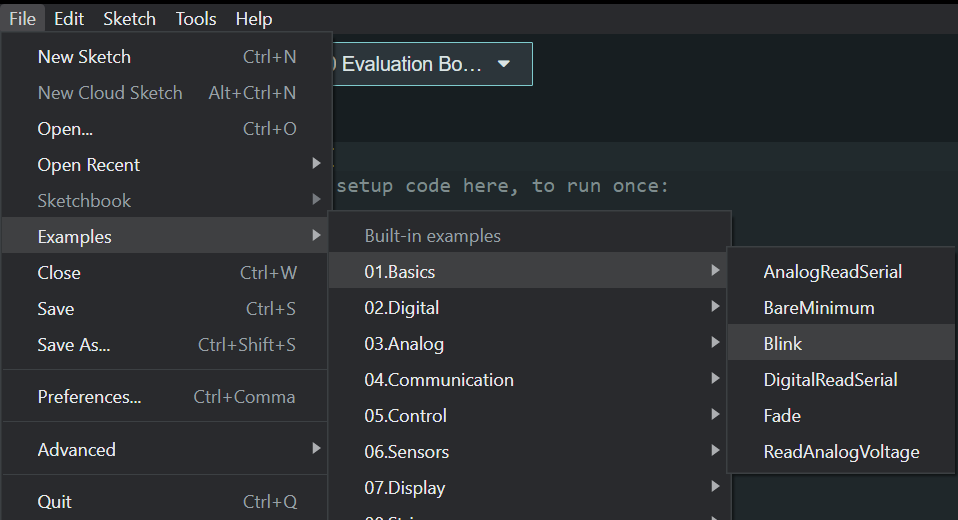

# NM180100EVB Setup Guide for Arduino IDE

This guide will walk you through how to get up and running with the NM180100EVB in the Arduino IDE. 

## Requirements

### Hardware
* NM180100EVB
* A USB to micro-USB cable to connect the board
* A Linux or Windows machine

### Software
* Arduino IDE
* ARM GNU Toolchain
* Segger J-Link
* Python

<b>Expand for the detailed software installation instructions </b>

 

### Install Arduino IDE

The Arduino IDE is where you will write the code that will run on the NM180100EVB.

<a href="https://www.arduino.cc/en/software" target="_blank"><b>Download Arduino IDE</b></a>

<a href="https://docs.arduino.cc/software/ide-v2/tutorials/getting-started/ide-v2-downloading-and-installing" target="_blank"><b>Installation Instructions</b></a>

---

 

### Install ARM GNU Toolchain

The ARM GNU Toolchain is used for compiling and building.

<a href="https://developer.arm.com/downloads/-/arm-gnu-toolchain-downloads" target="_blank"><b>Download ARM GNU Toolchain</b></a>

Windows

1. Download and install the Windows hosted cross toolchains.

> arm-gnu-toolchain-11.3.rel1-mingw-w64-i686-arm-none-eabi.exe

2. Add the compiler to your PATH using the **Add path to environment variable** checkbox.

Linux

1. Download the Linux hosted cross toolchains

> arm-gnu-toolchain-11.3.rel1-x86_64-arm-none-eabi.tar.xz

2. Extract the toolchain files to the directory where it will be stored. For example, to install the toolchain to `/opt` type the following

` sudo tar -xvf arm-gnu-toolchain-11.3.rel1-x86_64-arm-none-eabi.tar.xz -C /opt`

3. Add the compiler to your PATH.

---

 

### Install SEGGER J-Link

SEGGER J-Link is used to program and debug the NM180100EVB board.

<a href="https://www.segger.com/downloads/jlink/#J-LinkSoftwareAndDocumentationPack" target="_blank"><b>Download J-Link Software and Documentation Pack</b></a>

Details

1. Download the official J-Link Software and Documentation pack. The exact version will depend on your operating system. Download the version that applies to your operating system.

2. Add J-Link to your PATH.

---

 

### Install Python

Windows

1. Download the latest version of Python 3 from the <a href="https://www.python.org/downloads/windows/" target="_blank">Downloads page</a>.

2. Use the Installation Wizard to add Python 3 to your PATH.

3. Verify that the installation was successful by running the following command in a command prompt:

`python --version`

Linux

Python is usually pre-installed in Linux. If not, you can run the following command in a terminal to install Python

`sudo apt-get install python3`

---

 

## Install the NM180100 Arduino Core

To get your code to run on the NM180100EVB, you need to install the corresponding Arduino Core. 

1. Open the <a href="https://github.com/NorthernMechatronics/ArduinoCore-nm180100/releases" target="_blank">Releases Section</a> of the NM180100 Arduino Core github page. 

2. Find the most recent release, which will be at the top, and open the <b> Assets </b> dropdown.

3. Right click on the <i>.json</i> file, and copy the link address.

4. Open the Arduino IDE.

5. Open the Preferences menu under File > Preferences.

6. Paste the link address in the <b>Additional boards manager URLs</b> box.

7. Click <b>OK</b>

8. In the sidebar, open the Boards Manager by clicking the second icon from the top. Alternatively, you can click on Tools > Board > Boards Manager.

9. In the search bar, type in NM180100EVB, and the board should appear.

*INSERT IMAGE OF SEARCH RESULTS*

10. Click <b>INSTALL</b>

11. Now, select the board in the menu by clicking on Tools > Board > nm180100evb > NM180100 Evaluation Board.

---

 

## You're All Set!

And that's it! You are now ready to start writing code and running it on your NM180100EVB. 

---

 

# Blinking Light Example

## Setup

If you are new to this, and want a small example to use as a stepping stone to begin your journey, try this one!
 

Arduino provides some built in examples to help get you off the ground. Go open the <b>Blink</b> example in File > Examples > 01.Basics > Blink.

In order to run the Blink code on the board, ensure your board is plugged in and turned on. The power switch is located next to the micro-USB port on the board, and the <i>on</i> position is when the switch is flipped away from the micro-USB port. When the board is plugged in and turned on, one blue light and five orange lights should be lit up. 

---

## How To Run Code

In the top left, the Check Mark <!--[Check mark icon](./res/check_icon.png)--> icon compiles the code and checks for errors. The Arrow  icon compiles the code and loads it onto the board. 

Click the Arrow  button to load and run the Blink code on your board. Once the load completes, you should see one of the orange lights on the board start to blink. If nothing is happening, try pressing the <b>Reset</b> button situated next to the blue light. 

---

 

# Further Reading

The Arduino <a href="https://www.arduino.cc/en/Guide" target="_blank">Getting Started Guide</a> provides more content on what Arduino is, and how it works. 

The Arduino <a href="https://www.arduino.cc/reference/en/" target="_blank">Programming Language Reference</a> provides useful information that will help you write code for your board.